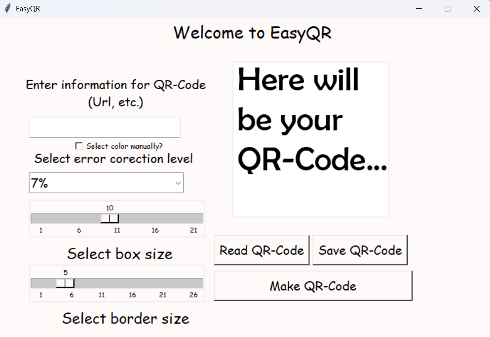

# EasyQR — Simple QR-code App


## Features 💡
- Generating QR-codes
- Generating QR-codes with custom colours
- Read QR-codes
- Error correction select
- Easy to use
- Size select


## Instalation ⬇️
```
git clone https://github.com/avsbestua/EasyQR.git
cd EasyQR
```
**Or just download latest release**

